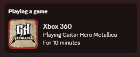
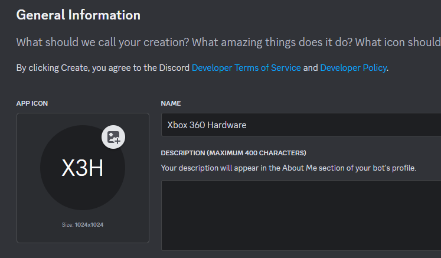

# Xbox 360 Discord Rich Presence Script



### Please note this script as well as this readme was written by ChatGPT.

### Tested and checked by a human.

This script updates your Discord Rich Presence with the currently playing game on your modded Xbox 360 running the Aurora dashboard with the Nova plugin.

## Features

- Displays the current game being played.
- Shows the elapsed playtime in a human-readable format.
- Updates every 15 seconds.
- Handles special cases for unknown games and the Aurora dashboard.
- Uses custom images for games when available.

## Requirements

- A modded Xbox 360 running the Aurora dashboard with the Nova plugin active.
- Your own [Discord Application Client ID](https://discord.com/developers/applications). 
- Python 3.x installed on your computer.
- `requests` and `pypresence` Python libraries.

## Installation

1. **Clone the repository:**
   ```bash
   git clone https://github.com/jnackmclain/Xbox360_presence.git
   cd Xbox360_presence
   ```

2. **Install the required Python libraries:**
   ```bash
   pip install requests pypresence
   ```

## Discord Application Client ID

Sign into the [Discord Developer Portal](https://discord.com/developers/applications).

Create a new Application and name it. The name will show up in the rich presence. I like using `Xbox 360 Hardware`.



Copy the client ID into the script, updating `YOUR_CLIENT_ID_HERE`


## Configuration

1. **Rename `config_default.ini` to `config.ini` which will have the following content:**
   ```ini
   [discord]
   client_id = YOUR_CLIENT_ID_HERE

   [xbox]
   ip_address = YOUR_XBOX_IP_HERE
   ```

2. **Update the client id with the application id we got earlier**

3. **Update the ip_address with the IP address of your Xbox 360**

```ini
   [discord]
   client_id = 12345678910

   [xbox]
   ip_address = 192.168.0.36
   ```

## Usage

You can run the script with or without providing the IP address of your Xbox as an argument.

### Option 1: Run the script with no arguments and the IP address in the config.ini will be used

### Option 2: Override the config.ini IP address as a command-line argument
```bash
python rich_presence.py 192.168.0.69
```

## Notes

- Ensure your Xbox 360 is powered on and connected to the same network as your computer.
- The Nova Web UI must be running on the Xbox for the script to work correctly.

## Example Output

When running, the script will update your Discord status to show the game you're playing along with the elapsed time:


## License

This project is licensed under the MIT License. See the [LICENSE](LICENSE) file for details.

## Acknowledgments

- [Aurora Dashboard](http://phoenix.xboxunity.net/): A dashboard replacement for Xbox 360.
- [Xbox Unity](http://www.xboxunity.net/): Source for images used in rich presence.
- [Nova Plugin](http://phoenix.xboxunity.net/): A plugin for the Aurora dashboard.
- [albertofustinoni](https://gist.githubusercontent.com/albertofustinoni/51f2ea0537130f4820a3f5ed49d69042/raw/9ffead88e369a40e120082ef385efea6fc1cbb81/Xbox360TitleIDs.json): Source for matching title id to title, used in rich presence.
- [pypresence](https://github.com/qwertyquerty/pypresence): A library for Discord Rich Presence.
- [requests](https://github.com/psf/requests): A simple, yet elegant HTTP library for Python.
